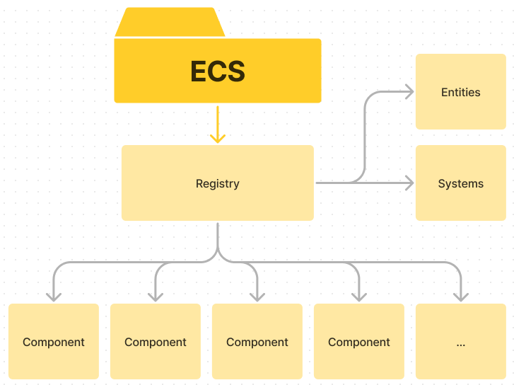

.. _ecs:

ECS Engine
==========

|

Introduction
------------

What is an ECS engine?

ECS stands for Entity-Component-System.
An ECS is a software architectural pattern mostly used in video game development for the representation of game world objects.
An ECS comprises entities composed from components of data, with systems which operate on entities's components.

|

Get started
-----------

Our ECS implementation is encapsulated within a library.
To integrate it into your project, you'll need to include and link it accordingly.
Let me provide you with the specific steps to set up your ECS engine.

Include the library
^^^^^^^^^^^^^^^^^^^

Include the ECS library header files in your project. You can achieve this through the standard include directive:

``#include "Registry.hpp"``

Link the library
^^^^^^^^^^^^^^^^
Link your project with the ECS library during the compilation process. Specify the library in your build configuration or makefile.

``g++ -o your_executable your_source_files.cpp -lregistry``

|

The Registry
------------

The registry is the core of the ECS. It's the class who store all the entities, components and systems.

To create a registry, you just have to create a new instance of the class with the constructor:

``Registry::Registry()``

|

Components
----------

A registry can't have multiples component with the same type, so you should use structures.

Create a components
^^^^^^^^^^^^^^^^^^^
To register the component into the registry, use the **registerComponent** method.

``SparseArray<TComponent>& Registry::registerComponent()``

|

Entities
--------

In an ECS, an entity is simply an index (usually of type size_t) who are associated with components.

Create an entity
^^^^^^^^^^^^^^^^
To create a new entity in the registry, use the **spawnEntity** method.
It allocates a new index for the entity and returns it to you:

``size_t &Registry::spawnEntity()``

Kill an entity
^^^^^^^^^^^^^^
When an entity is no longer needed, it can be destroyed using the **killEntity** method:

``void Registry::killEntity(size_t const& entity)``

Associate a component to an entity
^^^^^^^^^^^^^^^^^^^^^^^^^^^^^^^^^^
The **registerComponent** method will add a new component who store "ComponentType" datas.
If this component already exist, it will juste throw an error.

``typename SparseArray<TComponent>::reference_type Registry::emplaceComponent(size_t const& to, TParams... p)``

Remove data to an entity
^^^^^^^^^^^^^^^^^^^^^^^^
To remove a component from an entity, use the **removeComponent** method.

``void Registry::removeComponent(size_t const& from)``

Get a component value from an entity
^^^^^^^^^^^^^^^^^^^^^^^^^^^^^^^^^^^^
To get a component value from an entity, use the **getComponent** method and [] operator.

``SparseArray<TComponent>& Registry::getComponents()``

|

systems
-------

A system is a function which take components as parameters, gived to the registry.
When you call the system from the ECS, it will call it for every entities having all components given as parameters.
Thus you can make a sort between entities by giving them a specific component.

Call a system with the registry
^^^^^^^^^^^^^^^^^^^^^^^^^^^^^^^

Once you wrote you function, keep it in a ``std::function<void(TComponents&...)>`` variable.
Then, you can call it with the **Exec** method.

``inline void Exec(std::function<void(TComponents&...)> func)``

|

Example
-------

This simple code will create a registry, register two components, create an entity using these components, and call a system who make entities move.

.. code-block:: c++

    #include "Registry.hpp" // Include the lib

    struct Position { // Component Position
        int x;
        int y;
    };

    struct Velocity { // Component Velocity
        int x;
        int y;
    };

    void moveEntities(Position &position, Velocity &velocity) { // System who make entities move
        position.x += velocity.x;
        position.y += velocity.y;
    }

    int main(void)
    {
        bool gameIsRunning = true;

        Registry registry(); // Create a registry

        registry.registerComponent<Position>(); // Register the component Position
        registry.registerComponent<Velocity>(); // Register the component Velocity

        size_t Bob = registry.spawnEntity(); // Create Bob. Bob is an entity
        registry.emplaceComponent<Position>(Bob, (Position) {0, 0}); // Add a Position component to Bob
        registry.emplaceComponent<Velocity>(Bob, (Velocity) {1, 0}); // Add a Velocity component to Bob

        std::function<void(Position &pos, Velocity &vel)> moveSystem = moveEntities; // Put the system in a variable

        while(gameIsRunning) {
            registry.Exec(moveSystem); // Call the system
        }

        return 0;
    }

For every loop, Bob position will be updated by the system.
